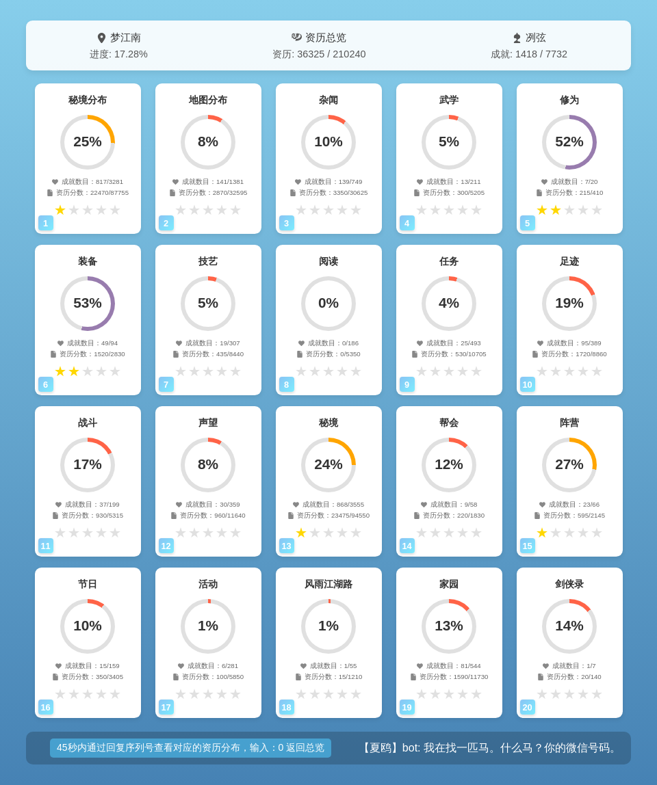
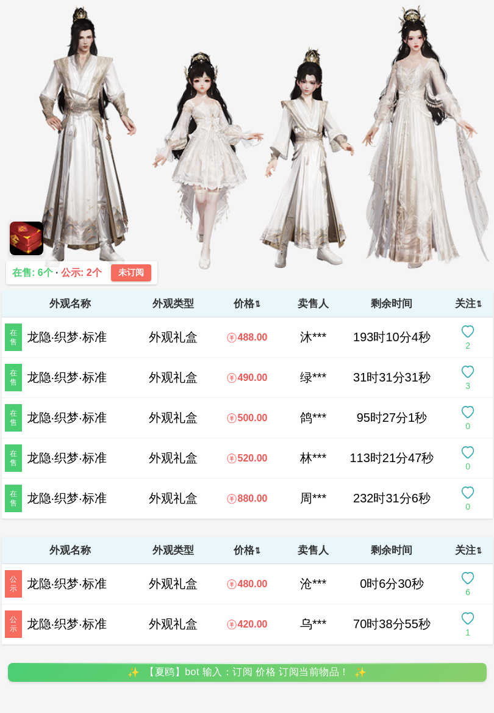
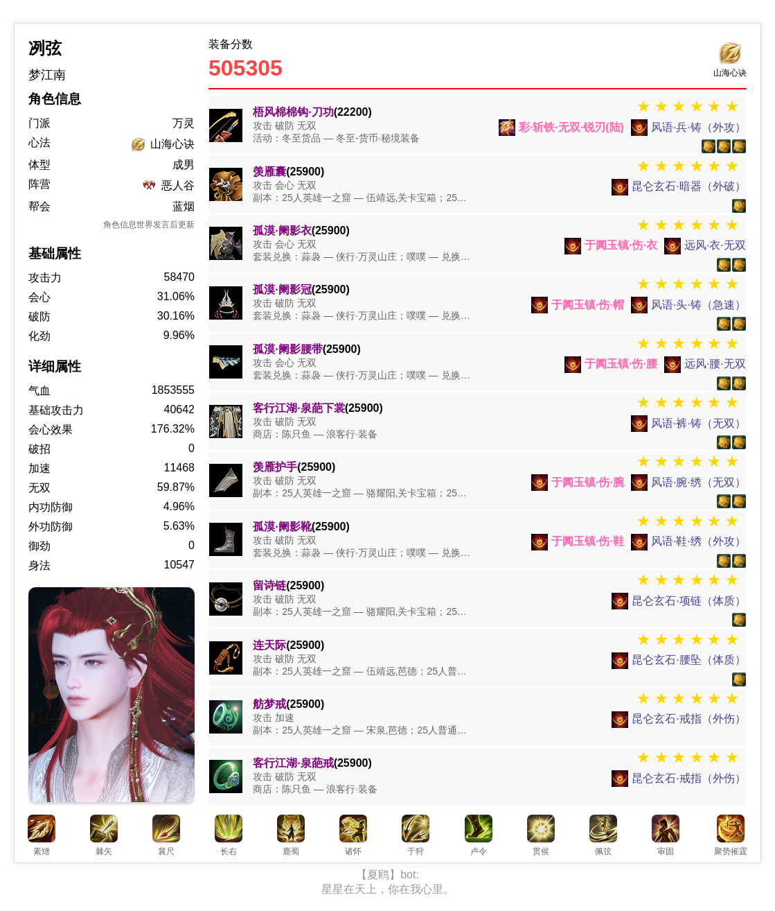
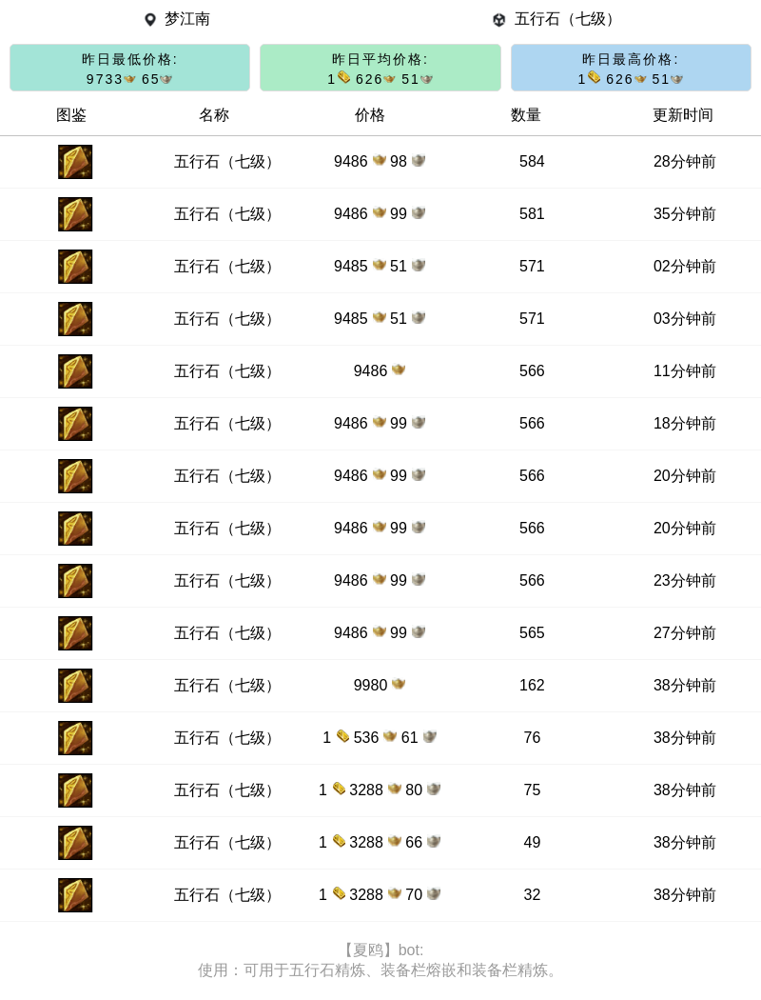

# JX3Bot

一个基于 Python 的剑网三机器人，提供各种游戏相关查询功能。使用 NoneBot 作为 QQ 机器人框架，建议直接docker 构建   简单省事，有些重复代码，懒得改了  反正稳定运行！

## 主要特性

- 使用 NoneBot 作为 QQ 登录框架
- WebSocket 反向代理（ws://192.168.100.1:5288/onebot/v11/ws）
- 多群绑定支持
- 完整支持 jx3api 的大部分功能
- 交易行物价查询
- 万宝楼物价查询和订阅提醒
- 奇遇查询
- 资历查询
- 竞技查询
- 烟花查询
- 等 自行查看代码

## 功能展示

### 资历


### 万宝楼订阅


### 角色属性


### 交易行查询


## 部署说明

### Docker 部署
详细的 Docker 部署说明请参考 [README-Docker.md](README-Docker.md)

注意：构建 Docker 镜像时可能需要配置代理以访问某些资源。

### WebSocket 配置
```bash
ws://192.168.100.1:5288/onebot/v11/ws
```

## 环境要求

- Python 3.9+
- NoneBot
- 见 requirements.txt

## 快速开始

1. 安装依赖：
```bash
pip install -r requirements.txt
```

2. 配置设置：
- 修改 config.py 中的配置
- 设置 WebSocket 反向代理地址
- 配置 QQ 机器人账号

3. 运行：
```bash
python bot.py
```

## 功能列表

### 基础功能
- 多群绑定支持
 
- WebSocket 反向代理

### 游戏查询
- jx3api 相关功能
- 交易行物价查询
- 万宝楼物价查询
- 奇遇查询
- 资历查询
- 竞技查询
- 烟花查询

### 订阅功能
- 万宝楼物品价格监控
- 价格变动提醒

## 贡献

欢迎提交 Issue 和 Pull Request！

## 许可证

MIT License 
